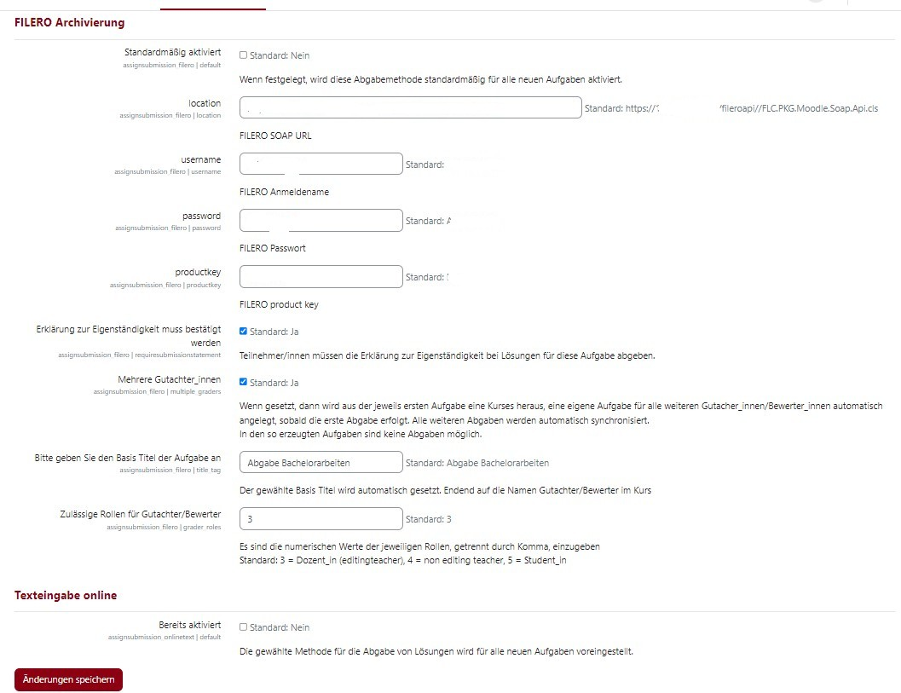
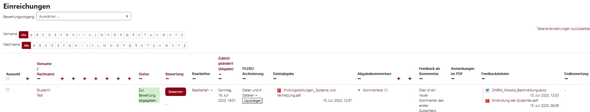
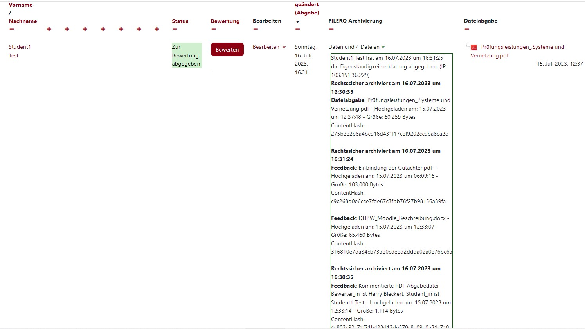

FILERO archiving of Moodle assignment data and files
==========
[Build Status](https://github.com/HarryBleckert/moodle-assignsubmission_filero/?branch=master)
[Open Issues](https://github.com/HarryBleckert/moodle-assignsubmission_filero/issues)

**This plugin archives assignment submission and feedback data and files to FILERO DMS.
It also features a multiple graders mode allowing to define assignments either exclusively allowing submissions and syncing them with graders assignments 
or exclusively allow grader feedback and disabling submissions.** 
* @package assignsubmission_filero
* @copyright 2023 onwards DHBW (https://DHBW.de/)
* @license   https://www.gnu.org/licenses/gpl-3.0.html GNU GPL v3 or later
* @author    Harry@Bleckert.com for LIB-IT DMS GmbH (https://www.lib-it.de/)

Requirements
------------
Moodle 4.0, 4.1, 4.2, 4.3, 4.4

Installation
------------
**From gitHub:**

1. Download the latest version of the plugin from the [Releases](https://github.com/HarryBleckert/moodle-assignsubmission_filero/releases) page.
2. Move to Moodle folder /mod/assign/submissions.
3. Use "git clone https://github.com/HarryBleckert/moodle-assignsubmission_filero.git".
4. OR: Extract the directory from the zip file or tar file you downloaded and rename it to 'filero' if it is not already named as such.
5.     Then place the 'filero' folder into your Moodle site's /mod/assign/submission/* directory.
6. OR: as Moodle Admin, install plugin from file.
7. Run the Moodle upgrade process either through the web interface or command line.
8. Open Website Administration -> Plugins -> Submission Plugins and enter the credentials required to connect with a FILERO account.
9. Configure other settings as wanted.
10. On assignment setup use the FILERO plugin by selecting "FILERO archiving" as submission type.

License
-------
https://gnu.org/licenses/gpl-3.0

Support
-------
If you need any help using this plugin, or wish to report a bug or feature request, please use the issue tracking system:
https://github.com/HarryBleckert/moodle-assignsubmission_filero/issues

Screenshots
-----------
These screenshots were taken on a Moodle 4.1 installation using Boost Union theme.
Appearances may vary slightly depending on your theme.

The global settings:

The summary of FILERO plugin:

Search results expanded to see extra links:

